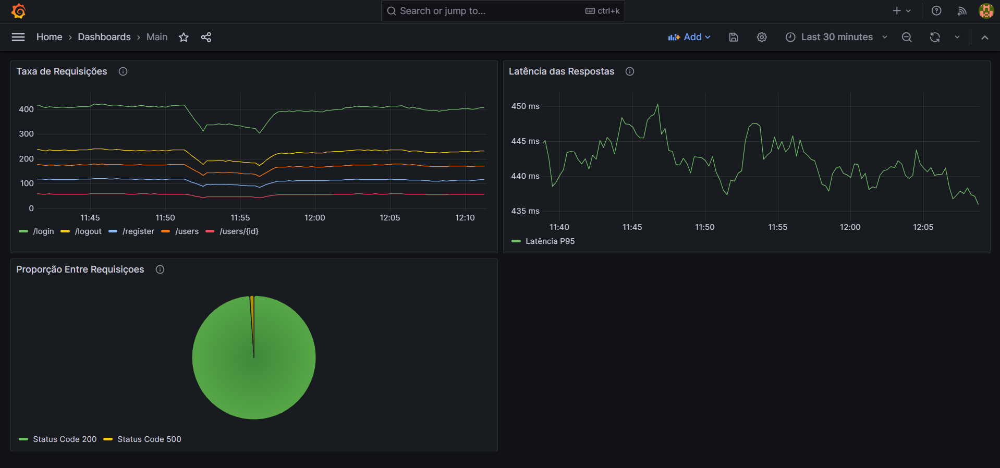
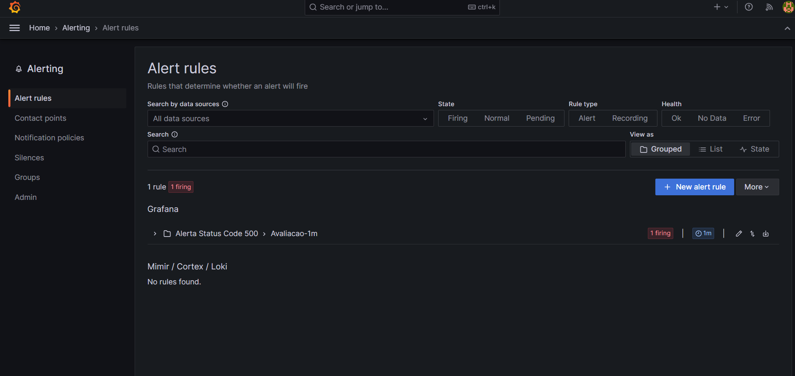

# Desafio DevOps: Stack de Observabilidade IDUS

## Visão Geral
Este projeto implementa uma stack de observabilidade moderna e escalável utilizando Docker Compose. O objetivo é coletar, armazenar e visualizar métricas geradas por um simulador de requisições HTTP, garantindo boas práticas de infraestrutura como código (IaC), segurança e estabilidade.

## Arquitetura da Solução
A stack é composta por 4 serviços principais rodando em uma rede Docker isolada. (`idus_monitoring_net`):

1. **prom-http-simulator:** Aplicação alvo geradora de métricas.
2. **Grafana Alloy:** Agente de telemetria moderno, responsável por fazer o *scrape* das métricas do simulador e enviá-las via *remote-write*.
3. **prometheus:** Banco de Dados de Séries Temporais (TSDB) configurado para receber dados do Alloy e armazená-los em volumes persistentes.
4. **Grafana:** Plataforma de visualização e alertas, configurada com dashboards interativos.

## Como Executar o Projeto

### Pré-requisitos
* Docker e Docker Compose instalados.

* Git para clonagem do repositório.

### Passo a Passo
1. Clone o repositório:
```bash
git clone https://github.com/leonardoxaviercf/devops-stack

cd devops-stack
```

2. Configure as variáveis de ambiente baseando-se no template de segurança.

3. Suba a infraestrutura:
```bash
docker compose up -d
```

## Decisões Técnicas e Boas Práticas
* Pipeline de Telemetria (Grafana Alloy): Em vez de utilizar o Prometheus para fazer o scrape direto, foi adotado o Grafana Alloy como agente intermediário empurrando dados via *remote-write*. Essa arquitetura é mais moderna, segura e escalável para ambientes distribuídos.

* Segurança e Proteção de Dados: Credenciais de acesso não estão disponibilizadas em hardcoded nos arquivos. Utilizou-se a abordagem de variáveis de ambiente com um arquivo .env.example versionado para garantir a praticidade do gerenciamento das informações sem expor senhas e informações privadas.

* Isolamento e Persistência dos Dados: Todos os serviços se comunicam exclusivamente através de uma rede bridge customizada. Os dados do Prometheus e Grafana são persistidos em Docker Volumes utilizando *named volumes* locais, garantindo que o histórico não seja perdido no reinício dos containers.

* Healthchecks e Imagens Distroless: Implementou-se rotinas de healthchecks nativas. Durante o desenvolvimento, identificou-se que a imagem do Grafana Alloy é distroless (não possui binários como *wget* ou *curl* por motivos de segurança). A orquestração foi adaptada para respeitar essa característica de segurança da imagem oficial, ajustando as dependências do docker-compose.yml.

## Evidências Visuais

### Dashboard de Observabilidade


O dashboard construído apresenta:

* Taxa de requisições por segundo (dividida por rotas).

* Latência em milissegundos (P95).

* Distribuição de status HTTP em proporção (Sucesso vs Erro).

### Regra de Alerta

Foi configurada uma regra de alerta baseada em PromQL para monitorar anomalias e picos na taxa de erros HTTP 500.